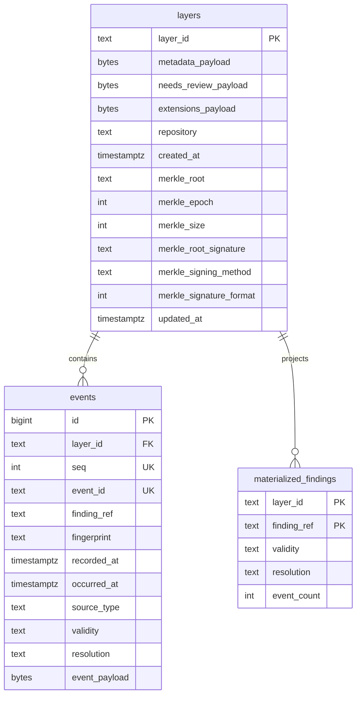

# Data model

`traust-ledger` owns and revisions its operational database objects. PostgreSQL
uses the fixed `traust_ledger` schema; SQLite uses an unqualified, dedicated
ledger database file.

`events.id` is internal storage identity. Authored order and domain identity are
separate constraints: `UNIQUE(layer_id, seq)` and
`UNIQUE(layer_id, event_id)`. Reconstruction always orders by `seq`, never by a
timestamp.

Complete metadata, queue items, root extensions, and events use canonical JSON
bytes. This preserves strings containing U+0000, which PostgreSQL JSONB cannot
represent. Typed event columns provide lifecycle indexes; typed layer columns
expose repository, Merkle root, epoch/size, and signature state for direct
operational queries. Payloads remain the reconstruction authority.

The database enforces authoritative-history rules in addition to application
checks. Existing event payloads must be an exact prefix of every write; only a
new suffix is inserted. PostgreSQL and SQLite triggers reject event updates,
deletes, sequence gaps, and layer deletion. PostgreSQL also rejects truncation.
`layers` remains the mutable current envelope because Merkle/signature and review
state change after a valid append. `materialized_findings` remains mutable because
it is a rebuildable projection, never integrity authority.

The schema revision is recorded in `traust_ledger.schema_revision`. Schema
creation and upgrades are explicit Ledger behavior; contracts storage bootstrap
does not create these objects. Runtime startup verifies an existing revision
without requiring schema-owner privileges.
